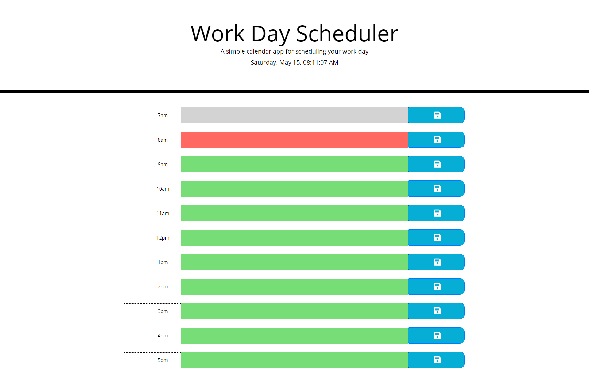

# barbarian
This is a scheduler that allows users to save written notes via time to their local computer. 

## Image

### Specifications

* User can enter in information/tasks by hour increment

* When a user clicks on the save button it saves the entered information to the local file

* When a user reloads the page the information is pulled from the local file

* Automatically change the background color of the row based on hour of day for past, present, and future times

## 💡 Notes
https://getbootstrap.com/docs/4.0/components/alerts/
https://stackoverflow.com/questions/62271505/how-can-i-set-different-colors-for-time-blocks-in-a-calendar-or-day-planner-usin
https://moment.github.io/luxon/docs/class/src/datetime.js~DateTime.html#instance-method-toLocaleString
https://www.youtube.com/watch?v=vAuUzEwTbck
https://www.w3schools.com/jquery/jquery_css_classes.asp

 
